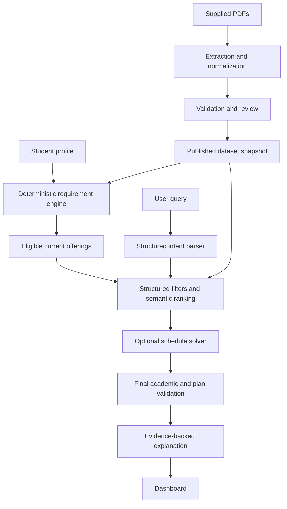

# BITS Academic Course Recommender — Architecture

Version: 1.0 | Date: 2026-09-28 | Status: implementation baseline

Companion: [Product requirements](PRD.md)

## 1. Architectural decision

Build a modular monolith: React frontend, Python/FastAPI backend, PostgreSQL database, and an offline document-ingestion pipeline. Use deterministic code for academic decisions and a constrained LLM workflow for intent parsing, semantic interest matching, and explanations.

The supplied documents are the academic source of truth. No LLM output may create a rule, waive a restriction, establish eligibility, or turn missing evidence into a positive fact.

## 2. Evidence and dataset constraints

Inspection covered the complete brief, archive inventory and content hashes, text extraction of the three main PDFs, and representative handouts and timetable tables. It was not a complete validation of every extracted academic fact.

| Finding | Design implication |
|---|---|
| 543 PDFs: 540 handouts, regulations (70 pages), bulletin (951), timetable (153) | Preprocess offline; avoid raw-PDF retrieval at runtime |
| 402 distinct file contents; 124 duplicate-content groups | Deduplicate extraction, preserve all file-to-course associations |
| No separate student profile in the archive | Collect profile and academic history in the UI |
| Timetable is Pilani Semester I 2026–27 | Current-offering coverage is scoped to this campus and term |
| New credit-hour framework and computer-code restrictions for 2026 admissions | Preserve cohort, credit system, and computer code on offerings |
| Shared handouts across different course codes | Document identity is separate from course identity and academic equivalence |
| Prerequisite section points outside the supplied timetable | Missing prerequisite coverage must remain unresolved |
| Cancelled sections, continued tables, tutorials and practicals | Parse table structure and section status explicitly |

Source anchors use PDF page numbers: timetable pp. 6, 8–11, 46, 50, 115–118; bulletin pp. 209 and 217; regulations §§1.15–1.16 and the elective/dual-degree provisions; handout `175_CS_F469.pdf`, pp. 1 and 3. Retain printed page labels separately during ingestion.

Example: `CS F469` and `CS U469` share a handout but appear with different credit frameworks. Some higher-degree codes recur with different computer codes. Do not identify an offering using course code alone.

## 3. System flow



The scheduling step may be bypassed for individual-course recommendations. Every response must state whether schedule feasibility was checked.

## 4. Modules and boundaries

| Module | Responsibility |
|---|---|
| ingestion | File manifests, extraction, normalization, validation, review and publication |
| catalog | Courses, semester offerings, relationships and source evidence |
| profiles | Versioned student profiles and course-attempt history |
| academics | Curriculum resolution, requirement allocation, eligibility and plan rules |
| retrieval | Exact lookup, structured filters, topic search and ranking |
| recommendations | Bounded orchestration and final result construction |
| scheduling | Section combinations, clashes and optional optimization |
| api | Authentication, schema validation, endpoints and error contracts |
| frontend | Profile, progress, query, evidence and semester-plan views |

Keep academic logic independent of HTTP, database sessions, and the LLM provider so it can be tested with explicit records.

## 5. Ingestion and publication

1. Build a manifest with paths, hashes, document family, pages and extraction status. Ignore `__MACOSX` metadata.
2. Extract text and table cells with page locations. Use OCR only when text extraction is inadequate.
3. Route regulations, bulletin, timetable and handouts through distinct parsers.
4. Normalize whitespace and course codes without deleting meaningful prefixes or suffixes.
5. Produce schema-validated candidate facts. LLM extraction, if used, must return evidence spans and may not publish facts directly.
6. Validate identifiers, numeric fields, assessment totals, applicability, references and table continuity.
7. Reconcile sources using field-specific authority and explicit scope. Send uncertainty and conflicts to a review queue.
8. Publish an immutable snapshot atomically. Rebuild derived search indexes from that snapshot.

Store raw files unchanged and retain rejected candidates for diagnosis. Hash-based ingestion must be idempotent. Reprocessing a new term must not overwrite the previous term.

Authority is contextual: timetable for current availability and meetings; applicable curriculum for requirements; regulations for general constraints; general and specific handouts for operational policies. A later date alone does not prove supersession. Explicit exceptions need their own evidence.

## 6. Data model

All academic entities reference a dataset snapshot. Every decision-bearing fact has a source reference and review status.

| Entity | Key fields |
|---|---|
| StudentProfile | id, version, campus, admission_year, programmes, curriculum_id, current_term, semester_position, minor, interests |
| CourseAttempt | student_id, course_id, term, grade/report, status, credit_value, credit_system, attempt_order |
| Course | id, code, title, department, description, topics |
| CourseRelationship | source_course, target_course, relationship_type, applicability, evidence; distinguish equivalence, substitution and shared teaching |
| Offering | id, course_id, campus, term, computer_code, cohort_scope, credit_system, credit_value, status |
| Section | offering_id, type, label, instructors, status, compatible_section_groups |
| Meeting | section_id, weekday, start, end, room, raw_slot, verification_status |
| ExamEvent | offering_id, type, date, start, end, raw_session, status |
| Curriculum | id, version, programme combination, campus, cohort scope, effective period |
| Requirement | curriculum_id, category, named_courses/pool, minimum_count, minimum_credits, credit_system, semester placement |
| AcademicRule | type, validated expression, scope, evidence, exceptions, approval requirement, review_status |
| PolicyFact | offering/course scope, property, value, evidence_status, applicability |
| EvaluationComponent | offering_id, type, weight, duration, timing, makeup conditions, evidence |
| SourceDocument / SourceFact | hash, filename, PDF page, printed page, bounding box, excerpt, parser version, confidence, review status |
| Plan / RecommendationRun | profile_version, dataset_version, rules_version, selected offerings/sections, parsed intent, checks, evidence |

Use foreign keys and unique constraints. Offering identity includes snapshot, campus, term and computer code, with explicit cohort/framework disambiguation where necessary. Do not blindly merge repeated codes.

Represent missing, conflicting and explicit-negative facts separately. For example, `midsem_present=false` requires evidence; a missing field is unknown.

Store credit value with its system (`units` or `credit_hours`). Conversion is forbidden unless an applicable documented conversion rule exists.

## 7. Academic engine

### Inputs and outputs

Input: profile version, target term, approved curriculum/rules, course attempts, offerings and optional selected plan.

Output: resolved scope, completed allocations, projected allocations, remaining counts/credits, required named courses, eligible/ineligible/unverified offerings, and structured reason codes with sources.

### Evaluation sequence

1. Resolve curriculum by campus, programme combination and admission cohort. Unresolved applicability blocks definitive requirement claims.
2. Interpret attempt history, including documented repeat, grade and equivalence semantics.
3. Allocate completed courses to requirements; prevent unauthorized double counting.
4. Track current courses as projected completion separately from earned completion.
5. Calculate lifetime remaining requirements and semester obligations separately.
6. Evaluate offering availability, prerequisites, prior preparation, restrictions and required approvals.
7. Validate joint semester rules after courses are combined.

Use a typed expression tree for rules: `all`, `any`, course completion with grade condition, programme/cohort membership, credit/count bounds and approval predicates. Treat rule data as data; never execute arbitrary expressions supplied by documents or the model.

Eligibility states:

- `eligible`: applicable required checks are supported and pass.
- `ineligible`: at least one supported applicable rule fails.
- `needs_verification`: evidence, student facts, applicability or approval is unresolved.

Do not treat an empty prerequisite list as verified absence unless coverage has been established. A documented absence and an extraction failure are different states.

The allocation algorithm must satisfy both counts and credits, preserve named-course requirements, and handle documented dual-degree/minor overlap. If multiple allocations are valid, choose deterministically and expose the allocation used. Do not use a greedy assignment that strands another requirement unnecessarily.

## 8. Intent, retrieval and recommendation

Parse queries into a strict schema containing requested category, interests, hard constraints, soft preferences, requested count, schedule preferences and clarification needs. Reject unknown operators and identifiers.

Example: “Suggest an AI-related DEL with no midsem” becomes category DEL, topic AI, hard filter `midsem_present=false`, and unknown facts excluded from exact matches.

Retrieval sequence:

1. Obtain the eligible current-offering set from the academic engine.
2. Apply verified structured filters.
3. Search descriptions and topics using exact/lexical search plus embeddings.
4. Rank with a documented, versioned score using semantic relevance, soft preferences and applicable requirement contribution.
5. Optionally solve section combinations.
6. Revalidate final candidates and the combined plan.
7. Explain only the accepted facts and checks.

At this scale, score all eligible candidates if needed. Avoid global semantic top-k retrieval that can hide academically valid matches before filtering.

Attendance needs separate fields for recording, minimum percentage, attendance marks and mandatory activities. Makeup conditions are component-specific. Subjective terms such as “lenient” require clarification or a transparent mapping to supported properties.

Return exact matches separately from alternatives. Never silently relax hard constraints. Unknown academic eligibility cannot appear as a verified recommendation.

The agentic workflow is bounded: parse, optionally clarify, call academic/retrieval tools, validate, explain. Use call and retry limits. No unrestricted SQL, filesystem access or arbitrary tool execution by the LLM. Treat document text as untrusted content.

If the LLM is unavailable, preserve profile/progress functionality and support structured filters with template explanations. Do not fabricate a parsed interpretation.

## 9. Scheduling

Select compatible lecture/tutorial/practical bundles, including common hours. Lock existing registrations when requested. Exclude cancelled sections and detect class and exam overlap using half-open time intervals.

Use the supplied slot legend. Undefined slots, TBA events and missing component mappings remain unverified. A blank cell may inherit table context; it does not automatically mean no exam or meeting.

CP-SAT variables represent candidate section selections. Constraints enforce required components, compatibility, non-overlap and relevant academic limits. Soft objectives penalize early classes, long gaps or occupied preferred-free days.

Return `feasible`, `infeasible`, or `unknown` with separate timeout/data-coverage reasons. An optimization timeout is not proof of infeasibility. Return conflicts or binding constraints where practical. Do not infer room-to-room travel times without data.

## 10. API contracts

| Method and route | Purpose |
|---|---|
| POST /profiles | Create profile |
| PATCH /profiles/{id} | Update with expected version; reject stale edits |
| GET /profiles/{id}/requirements | Completed, projected and remaining requirements |
| POST /eligibility/evaluate | Evaluate specified offerings with reason codes |
| POST /recommendations | Interpret query, retrieve, rank and validate |
| POST /plans | Save selected offerings and sections |
| POST /plans/validate | Recheck whole-plan constraints |
| POST /plans/solve | Optional section optimization |
| GET /offerings/{id} | Offering facts and policies |
| GET /sources/{id} | Authorized evidence and page reference |
| GET /admin/ingestion-runs | Coverage, failures and review queue |
| POST /admin/datasets/{id}/publish | Publish validated snapshot |

Recommendation responses include request ID, parsed intent, profile/dataset/rule versions, requirements summary, matches, alternatives, eligibility checks, matched preferences, uncertainties, evidence IDs and schedule-check status. Use 422 for malformed inputs, 409 for stale versions, and successful empty results with reasons when no course matches.

## 11. Stack and repository layout

- React + TypeScript frontend.
- FastAPI + Pydantic backend; SQLAlchemy and migrations for persistence.
- PostgreSQL authoritative storage and full-text search. Cache embeddings by model/version and normalized content hash; an initial in-process similarity scan is sufficient.
- pypdf/pdfplumber extraction and selective OCR fallback.
- OR-Tools CP-SAT for optional scheduling.
- pytest and property-based tests for academic invariants; browser tests for core flows.
- Docker Compose for reproducible local operation. Keep model credentials server-side.

```text
backend/app/{api,profiles,catalog,academics,retrieval,recommendations,scheduling}/
frontend/
ingestion/{extractors,normalizers,validators,publish}/
schemas/
migrations/
tests/{fixtures,unit,integration,evaluation}/
data/{raw,staging,published}/
docs/
```

Keep large raw PDFs, credentials and private student data out of Git. Commit manifests, parsers, schemas, reviewed rule records where permitted, and reproducible setup instructions. Test fixtures must be clearly synthetic or appropriately minimized.

## 12. Reliability and validation

Cache by profile version, target term, dataset/rule version and normalized intent. A profile edit or new snapshot invalidates dependent decisions. Revalidate saved plans before presenting them as current.

Log rule outcomes, retrieval candidate counts, extraction failures, latency and model usage without exposing private histories. Enforce profile ownership and separate administrative privileges.

Create manually verified fixtures for cohort restrictions, repeat grades, missing prerequisites, duplicate documents, dual-degree allocation, assessment policies, cancellations, exam conflicts and alternate sections. Property tests must enforce no unauthorized double counting, no mixed-framework totals, and no accepted known hard-rule violations.

Evaluate extraction accuracy, verification coverage, academic correctness, ranking relevance, citation correctness and schedule feasibility separately. High abstention alone is not success.

## 13. Implementation order

1. Manifest, schema and source-coverage map.
2. Family-specific extraction, validation and reviewed snapshot publication.
3. Academic-state engine and golden-profile tests.
4. Structured retrieval and deterministic recommendation response.
5. Constrained LLM intent/explanation integration.
6. Dashboard and versioned API integration.
7. Optional timetable solver.
8. End-to-end evaluation, README, reproducible setup and Postman collection.

Outstanding evidence dependencies: complete course-specific prerequisite coverage; applicability of supplied curriculum requirements to 2026 cohorts; complete grade/approval facts for individual students. Expose these limitations per profile and course instead of inventing defaults.
